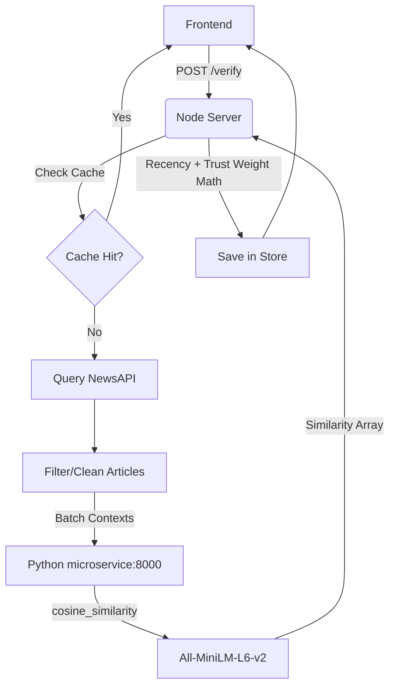

# TruthLens: Semantic News Verification Pipeline

## Problem Statement
In an era of viral misinformation, binary classification algorithms often fail to capture the nuance of unverified breaking news or syntactically disguised fake news. TruthLens solves this by treating credibility as a semantic distance vector—quantifying exactly how much a given story aligns with corroborated reports from authoritative sources.

## System Architecture

Our polyglot architecture operates in two layers:
1. **Node.js Orchestrator (Express)**: Handles frontend requests, cleans textual data, intercepts duplicate evaluations using local JSON caching, fetches semantic candidates from NewsAPI, and runs the final factor weighting formula.
2. **Python ML Microservice (FastAPI)**: Serves a high-tier SentenceTransformer embedding model loaded into system memory to prevent I/O bottlenecks.

## The Embedding Engine
We utilize the `all-MiniLM-L6-v2` model from Hugging Face via the `sentence-transformers` library. This model maps sentences and paragraphs to a 384-dimensional dense vector space. 
We batch the incoming user's text and N fetched NewsAPI articles, producing embeddings. The `cosine_similarity` between the user's vector and the articles' vectors gives us a statistical probability (between 0 and 1) of semantic alignment regardless of phrasing.

## Credibility Target Formula
TruthLens applies dynamic weighting to penalize unknown domains and outdated articles dragging the similarity vectors.
1. **Normalized Semantic Match**: Calculates the raw cosine similarity and normalizes it bounds from ~`0.15` up to `0.40+` into an isolated `0.0 - 1.0` multiplier.
2. **Effective Signal Weighting**: `source_trust × recency_weight`
3. **Credibility Math**: `finalScore = (Σ(normalizedMatch × signalWeight) / Σ(signalWeight)) × 100`

## System Limitations
- **Rate Limits**: NewsAPI restricts free-tier extraction to 100 requests per day. The JSON cache mitigates this, but high-velocity bursts still risk throttling.
- **Micro-hallucinations**: Extremely well-written, factual-sounding fake news that hasn't been debunked aggressively (yielding zero articles matched) falls back to "15% Unverified", rather than explicitly "Fake". 
- **Cold Boot Lag**: The ML microservice requires ~5 seconds to initialize its neural weights on cold start.
